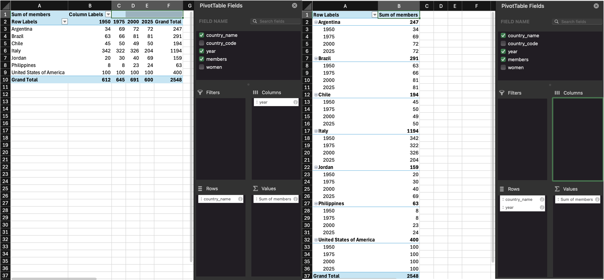

# Data Tidying {#sec-tidy}

```{r}
#| label: setup-tidy
#| include: false

library(tidyverse) # for data wrangling
```

```{r}
#| include: false
#| eval: false
# setup - doesn't need to run every time
# creates and saves tidy.csv and untidy.csv

members <- read_csv("../sdg-data/data/05/members.csv") |>
  select(-chamber)

tidy <- read_csv("data/parliament_simple.csv") |>
  filter(year %in% seq(1950, 2025, 25)) |>
  pivot_wider(names_from = year, values_from = pcnt_women) |>
  pivot_longer(`1950`:`2025`, names_to = "year", values_to = "pcnt_women") |>
  mutate(year = as.numeric(year)) |>
  filter(!is.na(sum(pcnt_women)), .by = country_name) |>
  left_join(members, by = c("country_code", "year")) |>
  mutate(women = round(pcnt_women/100 * members)) |>
  select(-pcnt_women) |>
  filter(country_code %in% c("USA", "JOR", "PHL", "CHL", "BRA", "RL", "ITA", "ARG"))
write_csv(tidy, "data/tidy.csv")

untidy <- tidy |>
  mutate(country = sprintf("%s (%s)", country_name, country_code)) |>
  mutate(`women / members` = sprintf("%s / %s", women, members)) |>
  select(-women, -members, -country_name, -country_code) |>
  pivot_wider(names_from = year, values_from = `women / members`)
write_csv(untidy, "data/untidy.csv")
```

## Intended Learning Outcomes {#sec-ilo-tidy .unnumbered}

- [ ] Be able to reshape data between long and wide formats
- [ ] Separate, change, reorder, and rename columns
- [ ] Use pipes to chain together functions

## Functions used {#functions-tidy}

* built-in (you can always use these without loading any packages)
    * base:: `library()`, `c()`, `list()`, `seq()`
* tidyverse (you can use all these with `library(tidyverse)`)
    * readr:: `read_csv()`
    * dplyr:: `summarise()`, `mutate()`, `filter()`, `select()`, `rename()`, `relocate()`
    * tidyr:: `pivot_longer()`, `pivot_wider()`, `separate()`
    * ggplot2:: `ggplot()`, `aes()`, ...
    * stringr:: `str_to_title()`, `str_replace()`
* Other
    * readxl: `readxl::read_xlsx()`
    

## Set-up {#sec-setup-tidy}

::: {.callout-tip .activity}

1. Open your `ADS-2026` project 
1. Download the [Data tidying cheat sheet](https://rstudio.github.io/cheatsheets/html/tidyr.html)
1. Download two data files into the "data" folder:
    * <a href="https://psyteachr.github.io/ads-v3/data/tidy.csv" download>tidy_data.csv</a>
    * <a href="https://psyteachr.github.io/ads-v3/data/untidy.csv" download>untidy_data.csv</a>
1. Create a new quarto file called `08-tidy.qmd`
1. Update the YAML header 
1. Replace the setup chunk with the one below

````
```{{r}}
#| label: setup
#| include: false

library(tidyverse) 
```
````

:::

## Data Structures

The data you work with will likely come in many different formats and structures. Some of these structures may be driven by how the software you use outputs the data, but data structures may also differ because of human intervention or attempts at organisation, some of which may not be particularly helpful.

Data cleaning and tidying will likely be the most time consuming and difficult task you perform. Whilst you can create code recipes for analyses and visualisations, as Hadley Whickham puts it, ["every messy dataset is messy in its own way"](https://vita.had.co.nz/papers/tidy-data.pdf), which means that you will often have to solve new problems that are specific to the dataset. Additionally, moving between data structures that are intuitive to read by humans and those that are useful for a computer requires a conceptual shift that only comes with practice. 

This is all a verbose way of saying that what lies ahead in this chapter is unlikely to sink in on the first attempt and you will need to practice with different examples (preferably with data you know well) before you truly feel comfortable with it.

First, some terminology.

An `r glossary("observation")` is all the information about a single "thing" in a single condition, such as at one point in time. These things can be customers, sales, orders, feedback questionnaires, tweets, or really anything. Observations should have a way to identify them, such as a unique ID or a unique combination of values like country and year.

A `r glossary("variable")` is one type of information about the observation. For example, if the observation is a sale, the variables you might have about the sale are the sale ID, the customer's ID, the date of the sale, the price paid, and method of payment.

A `r glossary("value")` is the data for one variable for one observation. For example, the value of the date variable from the observation of a sale might be `2021-08-20`.

::: {.callout-tip .activity}
The following table is data that shows the percentage of women in parliament for  each country and year.

```{r, echo = FALSE}
tidy <- read_csv("data/tidy.csv", show_col_types = FALSE)

tidy |>
  filter(country_code %in% c("ARG", "BRA"))
```

-   How many variables are there in this dataset? `r fitb(5)`
-   How many observations are there in this dataset? `r fitb(8)`
-   How many values are there in this dataset? `r fitb(40)`
-   What is `year`? `r mcq(c(x = "Observation", answer = "Variable", x = "Value"))`
-   What is `3298`? `r mcq(c(x = "Observation", x = "Variable", answer = "Value"))`

`r hide("Explain these answers")`

-   There are 2 variables, `country_name`, `country_code`, year`, `members`, and `women`.
-   There are 8 observations, one for each of 2 countries for each of 4 years.
-   There are 40 values, one for each combination of the 8 observations (rows) and 5 variables (columns)
-   `year` is a column name, also known as a variable
-   `3298` is a value because it is a single data point for one variable for one observation. 

`r unhide()`
:::

### Untidy data

First, let's have a look at an example of a messy, or untidy, dataset about the proportion of women in the upper house of parliaments for several countries (data sourced from [IPU Parline](https://data.ipu.org/)).

```{r}
untidy <- read_csv("data/untidy.csv", show_col_types = FALSE)
```

```{r tbl-untidy-data, echo = FALSE}
#| tbl-cap: Untidy table
untidy
```

* Each row has all of the data relating to one country. 
* The `country` column contains two values (name and code)
* The `{year}` columns contain the number of women / members.
* There is data for four different years in the dataset.

Let's say you wanted to calculate the average proportion of women in parliaments each year. You can't perform mathematical operations on the `{year}` columns because they are `r glossary("character")` `r glossary("data type", "data types")`.

You would probably normally use Excel to

1.  split `1950` column into `women_1950` and `members_1950` columns
2.  split `1975` column into `women_1975` and `members_1975` columns
3.  split `2000` column into `women_2000` and `members_2000` columns
4.  split `2025` column into `women_2025` and `members_2025` columns
5.  calculate `women_1950`/`members_1950` as a new column `prop_1950`
6.  calculate `women_1975`/`members_1975` as a new column `prop_1975`
7.  calculate `women_2000`/`members_2000` as a new column `prop_2000`
8.  calculate `women_2025`/`members_2025` as a new column `prop_2025`
9.  calculate the average of the columns `prop_1950`, `prop_1975`, `prop_2000`, and `prop_2025`


::: {.callout-tip .activity}
Think about how many steps in Excel this would be if there were 10 years in the table, or a different number of years each time you encountered data like this.
:::

### Tidy data

There are three rules for "`r glossary("tidy data")`, which is data in a format that makes it easier to combine data from different tables, create summary tables, and visualise your data.

-   Each observation must have its own row
-   Each variable must have its own column
-   Each value must have its own cell

This is the tidy version:

```{r}
tidy_data <- read_csv("data/tidy.csv", show_col_types = FALSE)
```

```{r tbl-tidy-data, echo = FALSE}
#| tbl-cap: Tidy table
tidy
```

* Each row is a country's data for a particular year. 
* There are now five variables (columns) because there are five different types of information we have for each observation: the country name, its 3-letter code, the year, number of members of parliament, and the number of women in parliament. 
* The number of `members` and `women` are in separate columns, so now you can perform mathematical operations on them.

To calculate the average proportion of women in parliaments each year in R, you could then:

1.  calculate the proportion of women for each country and year by dividing `women` by `members`
2.  calculate the average of this value for each year

```{r, message=FALSE}
tidy |>
  mutate(prop_women = women / members) |>
  summarise(
    avg_prop_women = mean(prop_women),
    .by = year
  )
```


::: {.callout-note}
If there were 10 years in the table, or a different number of years each time you encountered data like this, the code for producing the tables and plots above never changes.
:::

If you have control over how the data are recorded, it will make your life easier to record it in a tidy format from the start. However, we don't always have control, so this class will also teach you how to convert untidy tables into tidy tables.

## Reshaping Data

Data tables can be in `r glossary("wide")` format or `r glossary("long")` format (or a mix of the two). Wide data are where all of the observations about one thing are in the same row, while long data are where each observation is on a separate row. You often need to convert between these formats to do different types of summaries or visualisation. You may have done something similar using pivot tables in Excel.

```{r}
#| label: img-pivot-table
#| echo: false
#| fig-cap: "Converting between wide and long formats using pivot tables in Excel."


```

Our untidy table is in wide format, where each row is a country, and represents the data from several years. This is a really intuitive way for humans to read a table, but it's not as easy to process with code.

### Wide to long

The function `pivot_longer()` converts a wide data table to a longer format by converting the headers from specified columns into the values of new columns, and combining the values of those columns into a new condensed column.

This function has several arguments:

-   `cols`: the columns you want to make long; you can refer to them by their names, like `` c(`1950`, `1975`, `2020`, `2025) `` or `` `1950`:`2025` `` or by their numbers, like `c(2, 3, 4, 5)` or `2:5`
-   `names_to`: what you want to call the new columns that the `cols` column header names will go into
-   `values_to`: what you want to call the new column that contains the values in the `cols`

With the pivot functions, it can be easier to show than tell - run the below code and then compare `untidy` with `long` and the pivot code and try to map each argument to what has changed. 

```{r long-data}
long <- pivot_longer(
  data = untidy,
  cols = `1950`:`2025`,
  names_to = "year",
  values_to = "women_members"
)
```


```{r tbl-long-data, echo = FALSE}
#| tbl-cap: Long table
long
```

::: {.callout-warning}
Note that because the names of the columns are numbers, they need to be wrapped in backticks otherwise pivot_longer will think you mean the 1950th column through the 2025th column and you'll get an error like:
```
Error in `pivot_longer()`:
! Can't select columns past the end.
ℹ Locations 1950, 1951, 1952, …, 2024, and 2025 don't exist.
ℹ There are only 5 columns.
```
:::


::: {.callout-tip .activity}
Create a long version of the following table of how many million followers each band has on different social media platforms. You don't need to use code, just sketch it in a notebook or make a table in a spreadsheet.

| band               | twitter | instagram |
|:-------------------|:--------|:----------|
| The Beatles        | 3.8     | 3.8       |
| The Rolling Stones | 3.4     | 3.1       |
| One Direction      | 31.3    | 22.8      |

`r hide("Answer")`
Your answer doesn't need to have the same column headers or be in the same order.

| account            | social_media | followers |
|:-------------------|:-------------|:----------|
| The Beatles        | twitter      | 3.8       |
| The Beatles        | instagram    | 3.8       |
| The Rolling Stones | twitter      | 3.4       |
| The Rolling Stones | instagram    | 3.1       |
| One Direction      | twitter      | 31.3      |
| One Direction      | instagram    | 322.8     |

`r unhide()`
:::

::: {.callout-note}
If you're a researcher and you're used to thinking about IVs and DVs, you may find it easier to remember that each IV and DV should have its own column, rather than a column for each level of the IV. 
:::


### Long to wide

We can also go from long to wide format using the `pivot_wider()` function. Instead of returning to the original table with a row for each customer and a column for each year, this new wide table will have a row for each year and a column for each country.

-   `id_cols`: the column(s) that uniquely identify each new row
-   `names_from`: the column(s) that contain your new column headers
-   `values_from`: the column that contains the values for the new columns

```{r pivot-wider}
wide <- pivot_wider(
  data = long,
  id_cols = year, # identifying column(s)
  names_from = country, # the new column names
  values_from = women_members # the new column values
)
```

```{r tbl-wide-pivot, echo = FALSE}
#| tbl-cap: Data made wider with pivot_wider()
wide
```


## One value per cell

The cells in the `women_members` column actually contain two different values. We need to split it into two columns for the variables `women`, and `members`. 

You can split a column into parts with the function `tidyr::separate()`. There is a " / " between the two values, so we can split it along this -- if you are in charge of how data is stored, ensuring data is entered consistently makes this much easier.

```{r}
split_data <- separate(
  data = long,
  col = women_members, # the column to split
  into = c("women", "members"), # the new columns to create
  sep = " / ",   # split col by this string
  remove = TRUE, # whether to remove to old col
  convert = TRUE # whether to fix the data type of the new columns)
)
```

```{r tbl-long-separate, echo = FALSE}
#| tbl-cap: Separate with `tidyr::separate()`
split_data
```

::: {.callout-tip .activity}
Figure out how to split the `country` column into `country_name` and `country_code`. There are a few ways to do it, but the example below takes advantage of the fact that the default `sep` argument will split at any characters that aren't letters or numbers, so will split "Brazil (BRA)" into "Brazil", "BRA", and "".


```{r}
#|  webex.hide: true

tidy_data <- separate(
  data = split_data,
  col = country, 
  into = c("country_name", "country_id"), 
  extra = "drop" # ignore extra values
)
```


:::

## Pipes {#sec-pipes}

We've already introduced pipes in @sec-pipes-first but this type of data processing is where they really start to shine, as they can significantly reduce the amount of code you write.  

As a recap, a pipe takes the result of the previous function and sends it to the next function as its first argument, which means that you do not need to create intermediate objects. Below is all the code we've used in this chapter, and in the process we created four objects. This can get very confusing in longer scripts.

```{r}
untidy <- read_csv("data/untidy.csv", show_col_types = FALSE)

long <- pivot_longer(
  data = untidy,
  cols = `1950`:`2025`,
  names_to = "year",
  values_to = "women_members"
)

split_data <- separate(
  data = long,
  col = women_members, 
  into = c("women", "members"),
  sep = " / ",   
  remove = TRUE, 
  convert = TRUE 
)

tidy_data <- separate(
  data = split_data,
  col = country, 
  into = c("country_name", "country_id"), 
  extra = "drop" 
)
```

::: {.callout-warning}
You *can* give each object the same name and keep replacing the old data object with the new one at each step. This will keep your environment clean, but it makes debugging code much harder.
:::

For longer series of steps like the one above, using pipes can eliminate many intermediate objects. This also makes it easier to add an intermediate step to your process without having to think of a new table name and edit the table input to the next step (which is really easy to accidentally miss).

```{r}
tidy_data <- read_csv(file = "data/untidy.csv", show_col_types = FALSE) |>
  pivot_longer(
    cols = `1950`:`2025`,
    names_to = "year",
    values_to = "women_members"
  ) |>
  separate(
    col = women_members, 
    into = c("women", "members"),
    sep = " / ",   
    remove = TRUE, 
    convert = TRUE 
  ) |>
  separate(
    col = country, 
    into = c("country_name", "country_id"), 
    extra = "drop" 
  )
```

You can read the code above like this:

1.  Read the data with `read_csv()`

    -   `file`: from the file at r path("data/untidy.csv")\`,
    -   `show_col_types`: do not show the colukmn types message; 
    -    **and then**

2.  Reshape the data longer with `pivot_longer()`

    -   `cols`: take the columns from `1950` to `2025`,
    -   `names_to`: create a new column called "year" from the `cols` header names,
    -   `values_to`: create a new column called "women_members" from the `cols` values,
    -    **and then**

3.  Split multiple values in the same column with `separate()`

    -   `col`: separate the column `women_members`,
    -   `into`: into new columns called "women" and "members",
    -   `sep`: separate the values at each " / ",
    -   `remove`: do remove the old column,
    -   `convert`: do convert the new columns into the right data types;
    -    **and then**

4.  Split multiple values in the same column with `separate()`

    -   `col`: separate the column `country`,
    -   `into`: into new columns called "country_name" and "country_code",
    -   `extra`: if there are extra values, drop them;

Don't feel like you always need to get all of your data wrangling code into a single pipeline. You should make intermediate objects whenever you need to break up your code because it's getting too complicated or if you need to debug something.

::: {.callout-note}
You can debug a pipe by highlighting from the beginning to just before the pipe you want to stop at. Try this by highlighting from `data <-` to the end of the `separate` function and typing command-enter (mac) or control-enter (PC). What does `data` look like now?
:::

## Realistic Example

Let's load a fairly messy dataset to do some realistic data processing.

* [World Population Data](https://psyteachr.github.io/ads-v3/data/WPP2019_POP_F01_1_TOTAL_POPULATION_BOTH_SEXES.xlsx){download}

### Read in data

If you try to read it in before you look at it, you'll see the column names are a mess because there are 16 rows of text before the main table. So let's skip those 16 rows.

```{r}
file <- "data/WPP2019_POP_F01_1_TOTAL_POPULATION_BOTH_SEXES.xlsx"
pop <- readxl::read_xlsx(file, skip = 16)
```

Have a look at the first 10 columns (we already know there are a ton of year columns).

```{r}
glimpse(pop[, 1:10])
```

The years all imported as characters. We could fix that on import, but it's actually easier to fix it later once the dataset is long and all those bvalues are in a single column.

### Fill data

You'll also see a bunch of highlighted rows that are aggregate data. We only want to look at countries, so we want to filter the result to just the countries, but then we wouldn't know what region they're from. Here's a trick if you have data that are organised like this.

```{r}
pop <- readxl::read_xlsx(file, skip = 16) |>
  rename(country = 3) |>                                            # <1>
  mutate(region = ifelse(Type == "SDG region", country, NA),        # <2>
         subregion = ifelse(Type == "Subregion", country, NA)) |>
  fill(region, subregion) |>                                        # <3>
  relocate(region, subregion, .after = country) |>                  # <4>
  filter(Type == "Country/Area")                                    # <5>
```

1. Fix the terrible name in column 3
2. Make two new columns, region and subregion, and give them the same value as the country column if the Type column is "SDG region" or "Subregion, and NA otherwise
3. `fill()` fills in the NAs in a column with nearest value above it 
4. Move the new columns where they'll make more sense
5. Filter the dataset to only country rows

```{r}
#| echo: false
#| label: tbl-fill
#| tbl-cap: "The first 5 rows and columns after using `fill()` to add region and subregion"
pop[1:5, 1:5]
```


### Wide to long

Now we have data from 1950 to 2020 each in their own column, so we need to make this table longer.

```{r}
pop <- readxl::read_xlsx(file, skip = 16) |>
  rename(country = 3) |>                                            
  mutate(region = ifelse(Type == "SDG region", country, NA),        
         subregion = ifelse(Type == "Subregion", country, NA)) |>
  fill(region, subregion) |>                                        
  relocate(region, subregion, .after = country) |>                  
  filter(Type == "Country/Area") |>
  pivot_longer(`1950`:`2020`, 
               names_to = "year", 
               values_to = "population",
              )
```

```{r}
#| echo: false
#| label: tbl-long-filter
#| tbl-cap: "A random 10 rows after making the table long."
sample_n(pop, 10)
```

### Clean up

Now we can clean up some things. 

```{r}
pop <- readxl::read_xlsx(file, skip = 16) |>
  rename(country = 3) |>                                            
  mutate(region = ifelse(Type == "SDG region", country, NA),        
         subregion = ifelse(Type == "Subregion", country, NA)) |>
  fill(region, subregion) |>                                        
  relocate(region, subregion, .after = country) |>                  
  filter(Type == "Country/Area") |>
  pivot_longer(`1950`:`2020`, 
               names_to = "year", 
               names_transform = list(year = as.integer), # <1>
               values_to = "population",
               values_transform = list(population = as.numeric), # <2>
              ) |>
  select(country, region, subregion, year, population) |> # <3>
  mutate(population = round(population, 3)) |> # <4>
  mutate(region = str_to_title(region), # <5>
         region = str_replace(region, "And", "&")) # <6>
```

1. When you use pivot_longer, column names always become character data type, even if they are strings like "2020", so you can use `names_transform` to transform the names into a different data type.
2. Since the excel file was structured so oddly, all of the population data read in as characters. Now that we have gotten rid of values in that column that aren't numbers, we can convert it to a numeric column.
3. Narrow down to just the columns we want.
4. Excel sometimes produces rounding artifacts, so round to 3 digits.
5. Make the region in title case instead of all caps.
6. Making region title case created a bunch of "And", which we replace with "&".

```{r}
#| echo: false
#| label: tbl-long-select
#| tbl-cap: "A random 10 rows after selecting important columns."
sample_n(pop, 10)
```

### Plot the data

Now that we've put all this work into making a useful, tidy dataset, let's do something with it! First, calculate the total population in each region for each year.

```{r}
by_region <- pop |>
  summarise(population = sum(population),
            .by = c(year, region))
```

Now plot it.

```{r}
ggplot(by_region, aes(x = year, y = population, color = region)) +
  geom_line()
```

It's OK, but we could do better. Here's a trick to get the regions into the same order as they are at the right side of the plot. There is also some code to move the legend on top of the plot and other visual improvements.

```{r}
region_order <- by_region |>
  filter( year == 2020) |>
  arrange(desc(population)) |>
  pull(region)

# set region as a factor in desc 2020 population order
by_region$region <- factor(by_region$region, region_order)

ggplot(by_region, aes(x = year, y = population, colour = region)) +
  geom_line(linewidth = 1.5) +
  scale_x_continuous(breaks = seq(1950, 2020, 10)) +
  scale_y_continuous(breaks = seq(0, 2.5e6, 5e5), 
                     labels = c(0, "0.5B", "1.0B", "1.5B", "2.0B", "2.5B")) +
  scale_colour_brewer(palette = "Spectral") +
  labs(x = "Year", y = "Population (in Billions)", colour = NULL) +
  guides(colour = guide_legend(position = "inside")) +
  theme(legend.position = c(0, 1), legend.background = element_blank(),
        legend.justification = c(0, 1),
        legend.key.spacing.y = unit(-7, "pt"),
        legend.text = element_text(size = 8)
        )
```


## Exercises

Let's try a couple of examples. 

* Save your current quarto file, close it, and open a new qmd named "Patient_survey".
* Download a copy of [wide_exercise-1.csv](https://psyteachr.github.io/ads-v3/data/wide_exercise-1.csv){download} and [wide_exercise-2.csv](https://psyteachr.github.io/ads-v3/data/wide_exercise-2.csv){download} into your data folder.
* In the set-up code chunk, load the <pkg>tidyverse</pkg> then load the two data files in using `read_csv()` and name the objects `wide1` and `wide2`

```{r, message = FALSE,  webex.hide = TRUE}
library(tidyverse)
wide1 <- read_csv("data/wide_exercise-1.csv")
wide2 <- read_csv("data/wide_exercise-2.csv")
```

The two datasets represent simulated data from a patient satisfaction survey. We'll do them one at a time, as they differ in complexity.

### Survey 1

`wide1` has data from 50 patients who were asked five questions about their most recent experience at a health centre. The results from this questionnaire are typically reported as a single overall satisfaction score, which is calculated by taking the mean of the five responses. Additionally, the survey also records whether the patient was attending the clinic for the first time, or as a repeat patient. 

* Use your method of choice to look at the dataset and familiarise yourself with its structure and data. 

As noted, it's important to think through what your tidied data should look like. Often, the problem with data wrangling in R isn't actually the code, it's a lack of understanding of the data that's being worked on. 

1. How many **variables** should the long-form version of `wide` have? `r fitb(4)`
2. How many **observations** should the long-form version of `wide1` have? `r fitb(250)`

`r hide("Explain these answers")`

1. There should be four variables, as there are 4 types of data: patient id, whether they are a repeat patient, the question they were asked, and their response.
2. There will be 250 observations or rows of data because each patient will have 5 rows of data (one per question) and there are 50 patients (50 * 5 = 250).

`r unhide()`

### Tidy 1

Transform `wide1` to long-form using `pivot_longer()` and store it in an object named `tidy1`

```{r webex.hide = TRUE}
tidy1 <- wide1 |>
  pivot_longer(cols = q1:q5,
               names_to = "question", 
               values_to = "response")
```


### Survey 2

`wide2` also has data from 50 patients, however, there are now two measures included in the questionnaire. There are still five questions that relate to satisfaction, but there are also five questions that relate to whether the patient would recommend the medical practice to a friend. Both measures are typically reported by calculating an overall mean for each of the five items. 

* Use your method of choice to look at the dataset and familiarise yourself with its structure and data. 

This is not as simple as the first exercise because there's actually two potential ways you might tidy this data, depending on what you want to do with it and how you conceptualise the two different measurements. It's important to recognise that many of your coding problems will not have just one solution.

#### Tidy 2a

For the first option, we're going to treat the "satisfaction" and "recommendation" measurements as two categories of the same variable. This will be a fully long-form data set with five variables `id`, `repeat_patient`, `question` (the question number), `category` (whether it's `sat` or `rec`), and `response` (the numerical rating). 

* How many **observations** should the fully long-form version of `wide2` have? `r fitb(500)`

`r hide("Explain this answer")`

There will be 500 rows of data because each participant will have 10 rows: 5 for the satisfaction questions and five for the recommendation questions.

`r unhide()`

Transform `wide2` to full long-form using `pivot_longer()` and store it in an object named `tidy2a`.

This exercise requires multiple steps and you may need to look at the help documentation.

`r hide("Hint 1")`

`data |> pivot_longer() |> separate()`

`r unhide()`

`r hide("Hint 2")`

`into  = c("col1", "col2")`

`r unhide()`

```{r webex.hide = TRUE}
tidy2a <- wide2 |>
  pivot_longer(cols = q1_sat:q5_rec,
               names_to = "question", 
               values_to = "response") |>
  separate(col = "question", into = c("question", "category"))

```


```{r webex.hide = "Alternative solution"}
# combine pivot_longer and separate by setting two values for names_to
# must include names_sep to determine how to separate the column names
tidy2a <- wide2 |>
  pivot_longer(cols = q1_sat:q5_rec,
               names_to = c("question", "category"), 
               names_sep = "_",
               values_to = "response")

```

#### Tidy 2b

The second option is to treat the satisfaction and recommendation scores as two distinct variables. This only makes sense if the satisfaction and recommendation scores for each question number are related to each other (e.g., q1 is about the same thing for both questions), making them part of the same observation.

This version should also have five variables, but it won't be fully long-form, it'll be a slight mix of the two that we're going to call "semi-long". The variables in the semi-long version will be `id`, `repeat`, `question` (the question number), `sat` (the response for the satisfaction question), and `rec` (the response for the recommendation question). 

* How many **observations** should the semi-long version of `wide2` have? `r fitb(250)`

`r hide("Explain this answer")`

There will be 250 rows of data because, just like `tidy1`, each participant will have 5 rows, one for each of the five questions. The different responses to the satisfaction and recommendation questions are in different variables. 

`r unhide()`

This also takes multiple steps.

`r hide("Hint 1")`

You can reuse the code from `tidy2a`, you just need to add on an extra line that makes the data slightly wider.

`r unhide()`

`r hide("Hint 2")`

`data |> pivot_longer() |> separate() |> pivot_wider()`

`r unhide()`

```{r webex.hide = TRUE}
tidy2b <- wide2 |>
  pivot_longer(cols = q1_sat:q5_rec,
               names_to = "question", 
               values_to = "response") |>
  separate(col = "question", into = c("question", "category")) |>
  pivot_wider(names_from = "category", values_from = "response")
```

### Analysis and visualisation

Using `summarise()`, calculate the mean score for each participant for both satisfaction and recommendation. Do this for both versions of the dataset so that you can see how the structure of the dataset changes the approach you need to take.

```{r eval = FALSE, webex.hide = TRUE}
tidy2a |>
  summarise(mean = mean(response),
            .by = c(id, category))

tidy2b |>
  summarise(mean_satisfaction = mean(sat),
            mean_rec = mean(rec),
            .by = id)
```

Replicate the following:

#### Plot 1

Scatterplot showing the relationship between satisfaction and recommendation scores, by whether the patient is a repeat patient.

`r hide("Hint")`

`geom_jitter()`

`r unhide()`

```{r echo = FALSE, message=FALSE, warning=FALSE}
ggplot(tidy2b, aes(x = sat, y = rec, colour = repeat_patient)) +
  geom_jitter() +
  geom_smooth(method = "lm") +
  labs(x = "Satisfaction score", y = "Recommendation score", title = "Satisfaction and recommendation scores") +
  theme_classic()
```

```{r webex.hide = TRUE, eval = FALSE}
ggplot(tidy2b, aes(x = sat, y = rec, colour = repeat_patient)) +
  geom_jitter() +
  geom_smooth(method = "lm") +
  labs(x = "Satisfaction score", y = "Recommendation score", title = "Satisfaction and recommendation scores") +
  theme_classic()
```


#### Plot 2

Boxplots showing satisfaction and recommends scores for new and repeat patients separately.

```{r echo = FALSE}
ggplot(tidy2a, aes(x = repeat_patient, y = response, fill = repeat_patient)) +
  geom_boxplot(show.legend = FALSE) +
  facet_wrap(~category)+
  theme_bw() +
  scale_fill_brewer(palette = "Dark2")
```

```{r webex.hide = TRUE, eval = FALSE}
ggplot(tidy2a, aes(x = repeat_patient, y = response, fill = repeat_patient)) +
  geom_boxplot(show.legend = FALSE) +
  facet_wrap(~category)+
  theme_bw() +
  scale_fill_brewer(palette = "Dark2")
```

#### Plot 3

Histogram showing the distribution of all responses, across questions and categories.

```{r echo = FALSE}
ggplot(tidy2a, aes(x = response)) +
  geom_histogram(binwidth = 1, colour = "black", fill = "Grey") +
  labs(x = "Responses across all questions and categories") +
  theme_bw()
```

```{r webex.hide = TRUE, eval = FALSE}
ggplot(tidy2a, aes(x = response)) +
  geom_histogram(binwidth = 1, colour = "black", fill = "Grey") +
  labs(x = "Responses across all questions and categories") +
  theme_bw()
```

If your head hurts a bit at this point, rest assured it's absolutely normal. As we said at the start, reshaping and tidying data is a conceptual leap and there's no shortcut to the fact it just takes a bit of time and practice with different datasets - you will get there eventually!

### Share on Teams

Once you're done, share your rendered html file and the qmd file for the exercises on Teams in the Week 08 channel.

## Glossary {#sec-glossary-tidy}

```{r}
#| echo: false
glossary_table()
```

## Further resources {#sec-resources-tidy}

-   [Data tidying cheat sheet](https://raw.githubusercontent.com/rstudio/cheatsheets/main/tidyr.pdf)
-   [Tidy Data](http://vita.had.co.nz/papers/tidy-data.html)
-   [Chapter 5: Tidy Data](https://r4ds.hadley.nz/data-tidy)) in *R for Data Science*
-   [Chapter 4.3: Pipes](https://r4ds.hadley.nz/workflow-style.html#sec-pipes) in *R for Data Science*
